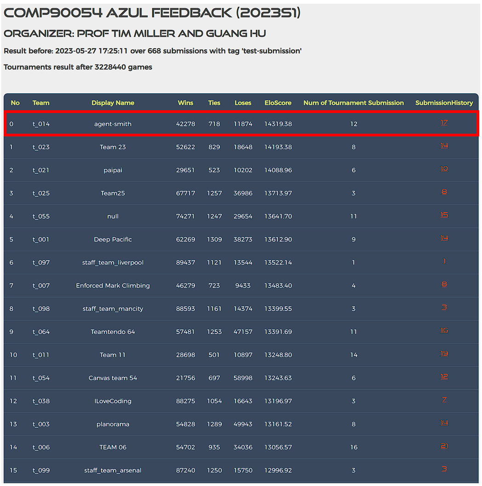

# Azul Project

 <p align="center"> 
    
 </p>

 **[Azul](https://www.ultraboardgames.com/azul/game-rules.php)** can be understood as a deterministic, two-player game. Understanding the results and different strategies is important for designing a good agent for this project.
 
## Agent Smith Performance 

Completed the ranking tournament with first place on the leaderboard against a total of 101 competing teams ✨ 

<p align="center"> 
    
 </p>


## Getting Started

**Make sure the version of Python used is >= 3.8, and that you have installed the following packages:**
```
func-timeout
GitPython
pytz
```
You can install them by running the following command:
```bash
$ python -m pip install func_timeout pytz GitPython
```
Running the final MCTS agent against a random agent:
```
python general_game_runner.py -g Azul -a agents.t_014.myTeam,agents.generic.random --agent_names MCTS_agent,random_agent -m 10
```

## Key files to read:

* [azul_model.py](azul_model.py): The model file that generates game states and valid actions. Start here to understand how everything is structured, and what is passed to your agent. In particular, ```getLegalActions()``` will provide a concise rundown of what a turn consists of, and how that is encapsulated in an action.

* `general_game_runner.py`: Support code to setup and run games. See the loadParameter() function for details on acceptable arguments.

* `azul_utils.py`: Stores important constants, such as the integer values used to represent each game piece.

## Game details

### GUI Layout: 

Upon loading Azul, both **Game** and **Activity Log** windows will appear. The Activity Log window will remain in front, tracking each agent's move. At the end of the game, you are able to click on actions in this window and watch the state reload in Game window accordingly (close the Game window to proceed forward).

The Game window will display the game board, with each agent's pieces counter to display the current score as the game progresses.

### How to play:

Please read the rules or play a sample game here: https://www.ultraboardgames.com/azul/game-rules.php

You can also watch [this video from game expert Becca Scott](https://youtu.be/y0sUnocTRrY)


### Computation Time:

Each agent has 1 second to return each action. Each move which does not return within one second will incur a warning. After three warnings, or any single move taking more than 3 seconds, the game is forfeit. 

There will be an initial start-up allowance of 15 seconds. During this time, your agent can do start-up computation, such as loading a policy. Your agent will need to keep track of turns if it is to make use of this allowance. 

### Debugging

There are many options when running the game, you can view them by:
```bash
$ python general_game_runner.py -h
```
A few options that are commonly used: 
* `-g Azul`: must specify the game is Azul
* `-t`: using text displayer (must use in docker)
* `-p`: print the sys.out and sys.err in the terminal
* `-s`: save the game replay
* `-l`: save the log
<!-- * `--half-scale`: scales the window to half size. -->
