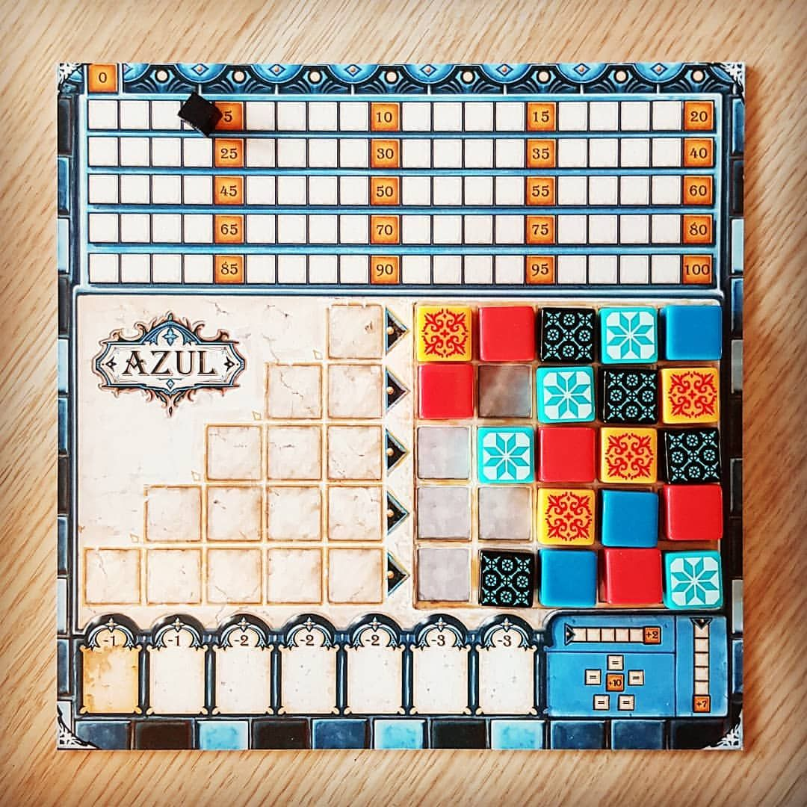
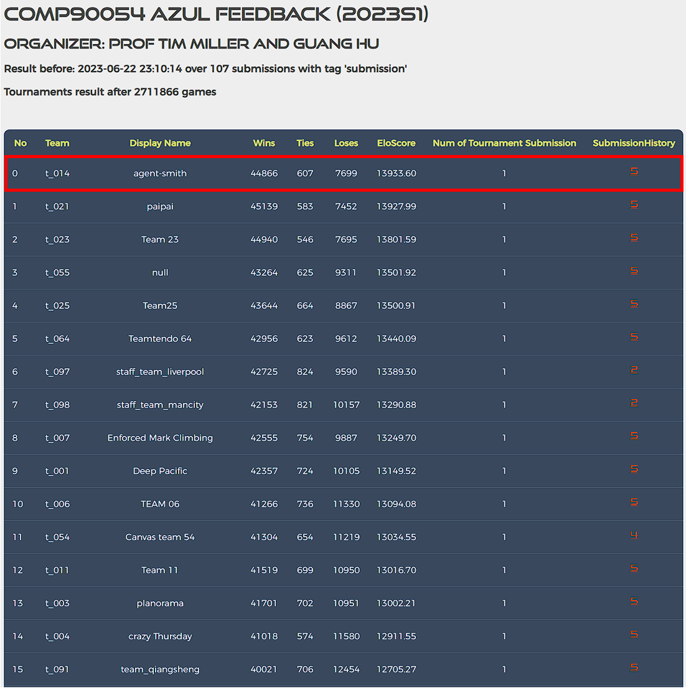

# Azul Project

 
 
    
 

 **[Azul](https://www.ultraboardgames.com/azul/game-rules.php)** can be understood as a deterministic, two-player game. Understanding the results and different strategies is important for designing a good agent for this project. The game frame is forked from [Michelle Blom](https://github.com/michelleblom)'s repository with the GUI developed by [Guang Hu](https://github.com/guanghuhappysf128) and  [Ruihan Zhang](https://github.com/zhangrh93). This Azul simulator is not included in the repo.
 
## Agent Smith Performance 

Completed the preliminary and final ranking tournament with first place on the leaderboard against a total of 101 competing teams ✨ 

 
    
 

# Youtube presentation

## Game details

### How to play:

Please read the rules or play a sample game here: https://www.ultraboardgames.com/azul/game-rules.php

You can also watch [this video from game expert Becca Scott](https://youtu.be/y0sUnocTRrY)

### Computation Time:

Each agent has 1 second to return each action. Each move which does not return within one second will incur a warning. After three warnings, or any single move taking more than 3 seconds, the game is forfeit. 

There will be an initial start-up allowance of 15 seconds. During this time, your agent can do start-up computation, such as loading a policy. Your agent will need to keep track of turns if it is to make use of this allowance. 

